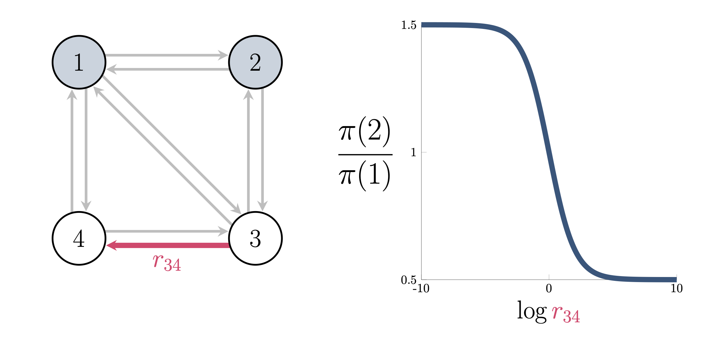

There can be no analogue of the Boltzmann distribution that applies to all nonequilibrium systems. The purpose of this entry is to explain why. At this stage, we will split our discussion into sections intended for different readers. For those seeking a physical discussion, read on. For those seeking a mathematical analogue, skip to [this section](#a-mathematicians-perspective).

### A physicist's perspective

This classic no-go theorem from 1975 \[[Landauer75](https://rattling.org/docs/reference/literature/#landauers-blowtorch-theorem)] was a response to the persistent hope in statistical physics to formulate a general "nonequilibrium Boltzmann distribution"—i.e., to express the nonequilibrium steady-state probability of any given state in terms of only *local* observables at that state. Landauer showed that this is in general impossible by providing a counter-example, illustrated in this picture:

This shows that we are able to change the steady-state probabilities in the wells $A$ and $B$ without changing anything locally in the neighborhoods of $A$ and $B$. All we need to do is apply localized heat (i.e., "a blowtorch") at another location, here affecting the barrier between these two wells. 

This proves that local information is not sufficient, in general, to predict the steady-state probability (as long as we are in nonequilibrium context). 

#### How Rattling circumvents this

Rattling, however, claims to do just this: it predicts the nonequilibrium steady-state $p_{ss}(x)$ in terms of the local Rattling value $\mathcal{R}(x)$. This is possible for two reasons:

1) the Rattling result is *approximate*
2) it is not fully general - but rather it is *[typical](https://rattling.org/docs/background/typicality/)*
   The blowtorch example falls outside the regime of applicability of Rattling as it is atypical - it is specifically constructed so as to exhibit strong non-local effects, i.e. it is an example of "adversarial fine-tuning." One of our core research goals is to show that a broad class of naturally occurring systems avoid such regime, and thus satisfies Rattling. #general

### A mathematician's perspective

Recall the Boltzmann distribution from [the entry on order](/docs/background/explaining-order/). The fact that there can be no variant of the Boltzmann distribution that applies to all nonequilibrium steady states is analogous to a simple observation about Markov chains. Consider a continuous-time Markov chain that has a unique stationary distribution $\pi$. The states of the chain represent the states of a physical system, and the transition rates between the states reflect the system's dynamics. 

The Markov chain analogue of the Boltzmann distribution would be an expression for the probability $\pi(x)$ of a state $x$ as proportional to a "local" function of the rates of the chain. For example, consider the chain with four states depicted below.

The arrows depict unit rates between the indicated states, aside from $r_{34}$, which is the rate at which the chain transitions from state $3$ to state $4$. The relative probability of states $1$ and $2$ changes as the rate $r_{34}$ varies. This means that it is not possible to write $\pi(x)$ as proportional to a function of the ingoing and outgoing rates of states $1$ and $2$. In other words, the stationary distribution of a Markov chain is generally a nonlocal function of its rates.
