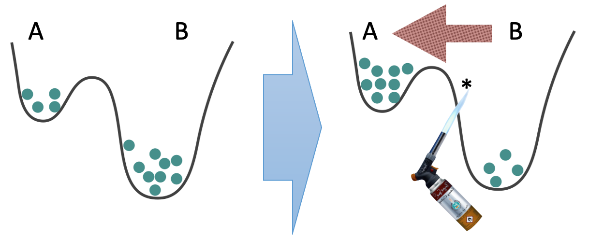

This classic no-go theorem from 1975 \[[Landauer75](https://rattling.org/docs/reference/literature/#landauers-blowtorch-theorem)] was a response to the persistent hope in statistical physics to formulate a general "nonequilibrium Boltzmann distribution" – i.e., to express the nonequilibrium steady-state probability of any given state in terms of only *local* observables at that state. Landauer showed that this is in general impossible by providing a counter-example, illustrated in this picture:

This shows that we are able to change the steady-state probabilities in the wells $A$ and $B$ without changing anything locally in the neighborhoods of $A$ and $B$. All we need to do is apply localized heat (i.e., "a blowtorch") at another location, here affecting the barrier between these two wells. 

This proves that local information is not sufficient, in general, to predict the steady-state probability (as long as we are in nonequilibrium context). 

## How Rattling circumvents this

Rattling, however, claims to do just this: it predicts the nonequilibrium steady-state $p_{ss}(x)$ in terms of the local Rattling value $\mathcal{R}(x)$. This is possible for two reasons:

1) the Rattling result is *approximate*
2) it is not fully general - but rather it is *[typical](https://rattling.org/docs/background/typicality/)*
   The blowtorch example falls outside the regime of applicability of Rattling as it is atypical - it is specifically constructed so as to exhibit strong non-local effects, i.e. it is an example of "adversarial fine-tuning." One of our core research goals is to show that a broad class of naturally occurring systems avoid such regime, and thus satisfies Rattling. #general
