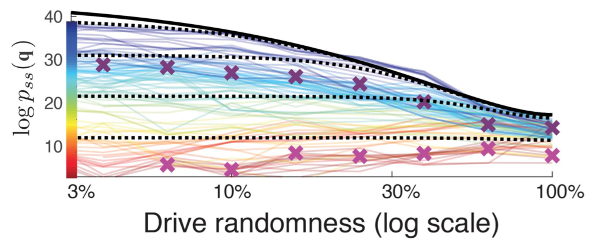
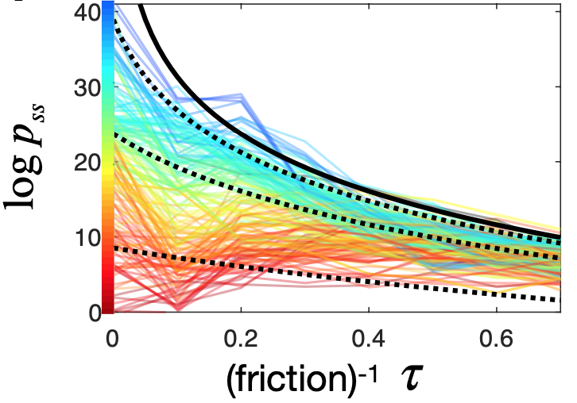

Q: So what exactly can Rattling theory tell me for my specific system, experiment or question? How do I use it?

First you need to consider if you think the Rattling hypothesis should hold in your system. Generally, it should hold for ["typical"](/docs/background/typicality/) systems (see [these guidelines](/docs/background/typicality/#general-guidelines)). If this applies, then there are several things you can do.

## Predict relative likelihoods 

To get the steady-state probability of any system configuration $x$, you need to know its Rattling $\mathcal{R}(x)$ and the normalization $Z$ (just as with Boltzmann distribution):
$$p_{ss}(x) \approx e^{-\gamma\; \mathcal{R}(x)}/Z \tag{1}$$
Rattling is powerful because it is easy to measure $\mathcal{R}(x)$—one just needs to initialize the system in state $x$ and see how fast it leaves that state on average. The generalization for systems with continuous configuration space is 
$$\mathcal{R}(x) = \frac{1}{2} \log \det D(x) \tag{2}$$
where $D(x)$ is the effective diffusion tensor at $x$, which can be similarly approximated from how fast it leaves $x$ (from taking a few short system trajectories starting at $x$, and calculating the covariance matrix (see details in [our Science paper](https://www.science.org/doi/10.1126/science.abc6182) Materials and Methods, sec 3.2). 
Note that, empirically, it is easier to measure Rattling of a state than it is to measure energy of a state, since energy cannot be locally defined in terms of transition rates among the states.

Without knowing $Z$, this allows us to predict relative likelihoods:
$$\frac{p_{ss}(x)}{p_{ss}(y)} \approx e^{-\gamma \,\left[\mathcal{R}(x) - \mathcal{R}(y)\right]} \tag{3}$$
The coefficient $\gamma$ here is a system-specific constant, which will often be close to 1, but may deviate somewhat if the system doesn't quite meet the mentioned [guidelines](/docs/background/typicality/#general-guidelines) (e.g., its configuration space is 6-dimensional rather than 100-dimensional). See [here](/docs/background/formalizing-rattling/) for more details on what $\gamma$ is. Either way, it is easy to estimate empirically from a few state-measurements and then make predictions for the rest. 

## Predict absolute likelihoods?

But to predict whether of not a system will self-organize, relative likelihoods are not enough, and so we need to find $Z$. $Z$, however, is not so easy to estimate empirically, since it depends globally on all configurations $x$. Unless we have empirical access to all system states, which is usually impractical, we need some theoretical calculation to find $Z$, and so some theoretical understanding of the global system properties. This is similar to finding the partition function in statistical mechanics, except that calculating energy of a state is well-known, while calculating its rattling is generally an [open question](/docs/research-directions/predicting-rattling/). 

We have some examples where we were able to successfully do this and predict the phase transition to self-organization (e.g., [Vicsek model](/docs/examples/vicsek-model/)), but it's not clear for which systems this is or isn't possible. 
In other cases, it may be possible to combine theoretical and empirical methods to estimate $Z$—by sampling a representative set of configurations and measuring their rattling (here you need a sufficient understanding of your system to know how to choose that "representative set").

## Destabilize by adding noise

Rattling theory also tells us how we can destroy self-organization in our system, and gives quantitative predictions for this. 

For example, if we can somehow add white thermal noise of temperature $T$ to our dynamics, then this predictably raises the Rattling of all configurations. Using the formula for Rattling in continuous systems eq.(2): $\mathcal{R}(x) \to \mathcal{R}^T(x) = \frac{1}{2} \log \det \left(D(x) + T \;I\right)$, where $I$ is the identity matrix. In terms of eigenvalues of $D$, this can be expressed as $\mathcal{R}^T = \frac{1}{2} \sum_{\lambda_D} \log \left(\lambda_D + T\right)$, and so the exact result will depend on all eigenvalues $\lambda_D$ (and especially on the smallest one).

But there is a useful bound we can use to get a general result: $\mathcal{R}^T(x) \geq \frac{1}{2} \log \left(\det D(x) + \det (T \;I)\right) = \frac{1}{2} \log \left(e^{2 \mathcal{R}(x)} + T^d\right)$, where $d$ is the dimension of the configuration space. This lower bound "pushes the Rattling up" for all configurations, ensuring that low-$\mathcal{R}$ configurations "melt" at this predicted rate with $T$ (or faster).

### Different ways to add noise
Adding thermal noise doesn't always make sense – but we can often add some source of randomness. In [our Science paper](https://www.science.org/doi/10.1126/science.abc6182), we were working with a swarm of robots, and achieved this same effect by adding some randomness to the way we drove their motors. This plot from the paper shows how the above analytical prediction (black lines) matched to the empirical observations (colored lines) for various system configurations $q$ (color indicates $\mathcal{R}(q)$ before the added noise, with blue = low-$\mathcal{R}$ configurations). This correctly predicts the melting phase transition:

We also used this same result in another way for the same robot swarm: instead of introducing randomness to the motors, we reduced the table friction so robots would slide around. This meant that the energy being put into the system got a chance to thermalize before being dissipated out – effectively creating a thermal bath for the robots. And energy balance calculation allowed us to calculate this thermal "temperature" as a function of friction, and the above analytical result again gave us a prediction we could verify empirically: 

## Predict self-organized configurations

Here we get more into qualitative territory – but this intuition has been very helpful in guiding us in designing experiments and predicting the self-organization we can expect. 

The main idea is this:  
* Rattling is the entropy of local forces acting on the configuration
* local forces come from 2 sources: external drive + internal system dynamics or self-interactions
* low-rattling is achieved when internal dynamics don't generate any additional entropy over and above that of the drive (assuming the system cannot decouple from the drive)
* Given your system and your drive, are such configurations possible? How?

This means that the drive has to be regular and predictable enough for the system to be able to adapt to it. This condition is a requirement on how "smart" the system is capable of being, and what sorts of things it's capable of learning with its dynamics. If the information needed to predict the drive (cf. [semantic information](https://royalsocietypublishing.org/doi/10.1098/rsfs.2018.0041)) is more complex than the system can learn, then the drive will look random from the system's perspective. On the other hand, if the information in the drive is so simple that a vast number of system configurations can be stable to it (i.e., generate no additional entropy), then the self-organization will not be very selective (see supplement fig. S6 in [our Science paper](https://www.science.org/doi/10.1126/science.abc6182)). 
Note that formalizing the relation between Rattling and semantic information is a great open problem. #open

## Control self-organized configurations 

Following 

([our paper](https://www.science.org/doi/10.1126/science.abc6182) examples - prop ratios, control, predict, etc...