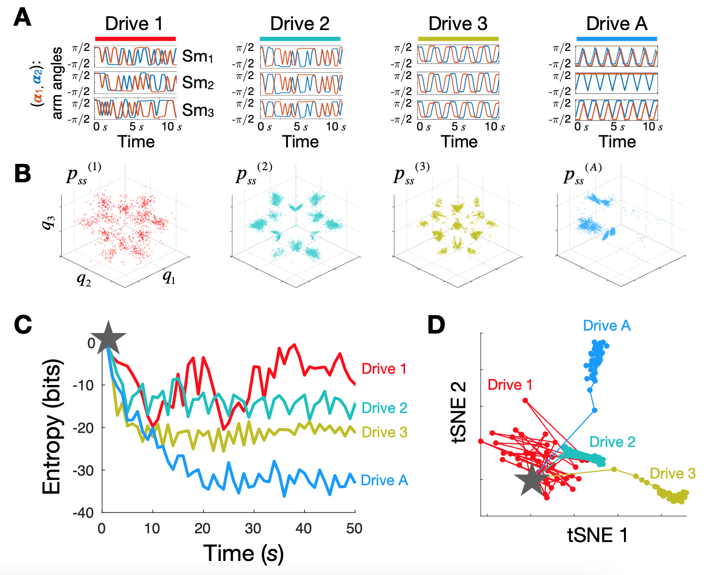

What makes Rattling theory especially interesting is that while it starts as a simple claim about system dynamics, it leads to a claim about information content of selected system configurations and learning from the drive. 

The basic idea is:
* Rattling hypothesis is "survival of the stablest" - you end up in places that you don't leave
* If your environment is violent and complex, being stable in it requires learning to predict it
* So does this give us a general theory of adaptation and learning for non-biological systems?

Roughly speaking, this seems plausible, but some work is still needed to formalize and clarify the exact claims and their proofs. 

## Illustration in robot swarm experiments

This is a figure from the supplement of our  [our Science paper](https://www.science.org/doi/10.1126/science.abc6182) (see fig. S6 for details). The 4 different drives (ways we drive the 6 motors - 2 for each of 3 robots in our swarm) shown here in (A), left to right, have different amounts of predictive information or Kolmogorov complexity – minimal amount of information needed to predict them. For Drive 1, all 6 motors are driven randomly (between angles $\pm \pi/2$ each 0.5 seconds) – defines our baseline, which we call 0 bits predictive information. Drive 2, driving is random in time, but all 3 robots are doing the same thing. We could encode this statement using 4 bits of data: first robot moves its 2 motors randomly, and the other 4 motors are then fully determined. Since each motor can be in one of two positions, this gives 4 bits. Drive 3 now also has a specific pattern in time, which requires 4 bits to specify for first motor, second motor follows the first with a phase delay (+2 bits), and the other 4 motors follow the first two (+4 bits) = 10 bits. In the last drive, each motor does its own thing with period 3 and must be specified separately, requiring 18 bits. (Note that these numbers aren't very rigorous and just meant to illustrate growing drive complexity)

So we have a progression of drives with more and more complexity. (B) shows the steady-state distributions that result from each drive – and we see that more complex drives lead to lower entropy distribution. (C) quantifies this intuition by showing how the steady-state distribution forms over time as we start with uniform distribution over all possible system configurations (gray star), and run each drive, watching the system self-organize. The curves showing how the distribution entropy drops create the intuition that the different drives are being encoded in the distribution, with more complex drives giving a larger drop in entropy (more encoded information). Finally (D) shows how the specific shapes of the 4 distributions diverge over time, suggesting that the encoded drive information could be decoded from each final distribution.

### Too much predictive information
Another exciting example not shown in this picture but that we saw experimentally was that if we kept increasing the drive complexity, up to 24 bits, then this exceeded the system's "storage capacity," and the steady-state went back to looking like for Drive 1 – the drive was so complex that it looked random to the system. That's why Drive 4 (Drive A) in the above picture has only period 3 - so that 6 arms \* 3 positions \* 1 bit each = 18 bits, while period 4 would raise this to 24 bits, which was already too much.  

### Learning in distribution vs in a single configuration
The above example makes a convincing case that the *probability distribution* of all possible system configurations encodes the drive information. A stronger claim would be to show that a single configuration can already encode this. This could be the case if the resulting steady-state distributions for the different drives would be entirely non-overlapping – which we could expect for sufficiently complex systems and complex drives. If we think about this in analogy to living systems, that would be like making claims about properties of the environment by studying the resulting ecosystem (entire distribution of possible outcomes), versus studying a single organism (a particular configuration).

## Dynamics as Bayesian inference

This great paper formalized what it means

Semantic information

Need to formally make these connections - low hanging fruit
